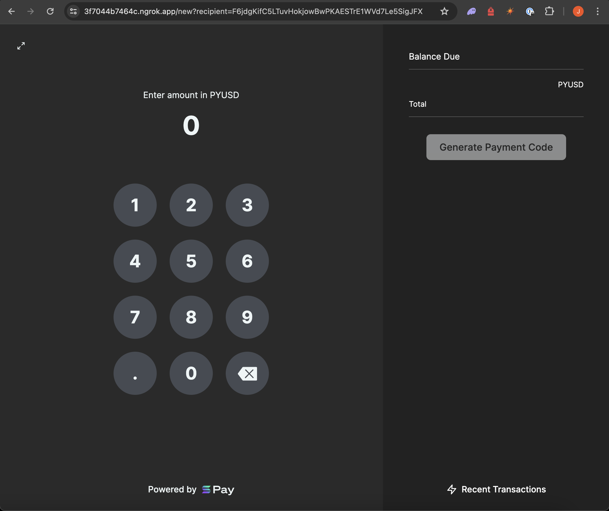

This repository contains an updated version of the original [Solana Pay point-of-sale demo](https://github.com/anza-xyz/solana-pay/tree/master/examples/point-of-sale) that supports Token2022 token transfers. The implementation for the Solana Pay Transaction Request API can be found [here](/point-of-sale/src/server/api/index.ts)

## Prerequisites

1. Create a Helius Account:

-   Sign up for a free account at [Helius](https://dev.helius.xyz/dashboard/app) to obtain a personal RPC endpoint with enhanced rate limits.

2. Create a Ngrok Account:

-   Sign up for a free account at [Ngrok](https://ngrok.com/) to enable tunneling your local server to an HTTPS URL, which is required for Solana Pay transaction requests.

## Setup

### Clone the repo

Clone the repository and then open the `point-of-sale` directory.

```
cd point-of-sale
```

### Environment Variables

Rename `.env.example` to `.env.local` and update the values with your Helius RPC endpoint. For example:

```
CLUSTER_ENDPOINT=https://api.mainnet-beta.solana.com
RATE_LIMIT=10
RATE_LIMIT_INTERVAL=60
NEXT_PUBLIC_MAINNET_RPC=https://soviet-guenevere-fast-mainnet.helius-rpc.com
```

### Install Dependencies

```
pnpm install
```

### Run the Demo

```
pnpm dev
```

This starts a development server on localhost:3000.

### Tunneling with Ngrok

```
ngrok http 3000
```

This will provide a temporary https URL with an output similar to:

```
Forwarding https://3f7044b7464c.ngrok.app -> http://localhost:3000
```

The ngrok URL will allow you to scan the Solana Pay QR Code with a Solana wallet on a mobile device while testing locally.

### Open the point of sale app

Access the application by navigating to your Ngrok URL with `recipient` query parameter set as a Solana address.
This is the address that tokens will be transferred to.

```
https://3f7044b7464c.ngrok.app/?recipient=YOUR_WALLET_ADDRESS
```

For example:

```
https://3f7044b7464c.ngrok.app/?recipient=F6jdgKifC5LTuvHokjowBwPKAESTrE1WVd7Le5SigJFX
```


